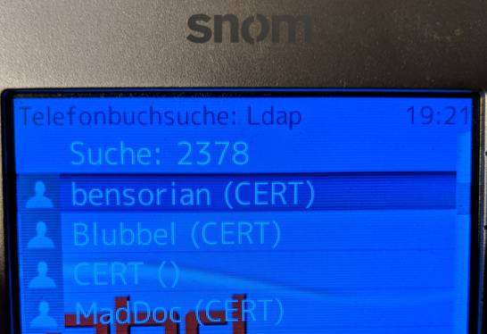

## What?
LDAP Server implementation for the [GURU3](https://guru3.eventphone.de) public phonebook.

## Why?
We want to support the LDAP Phonebook feature of many SIP Phone and also the Mitel OMM.

## Can I take a look?

## I found a bug!

Please open an issue. If you've found a security issue please contact us via [twitter](https://twitter.com/eventphone) or meet us at the POC desk (during an event).